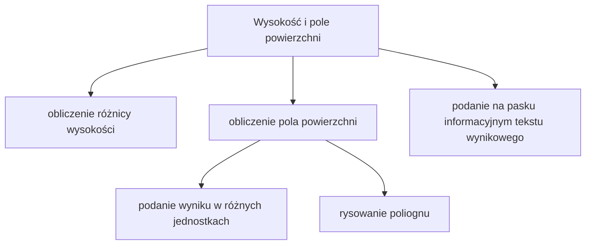
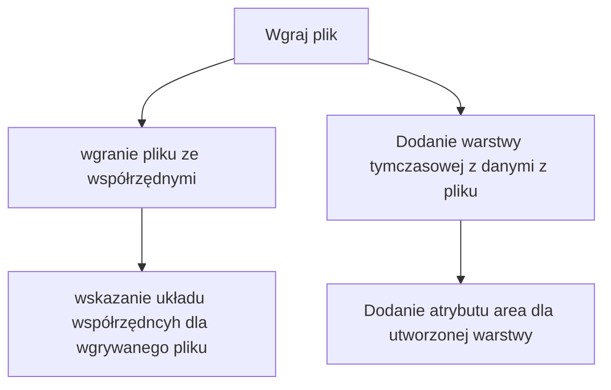

# Wtyczka QGIS
## Opis
Wtyczka do programu QGIS została stworzona w celu obliczania różnicy wysokości oraz pola powierzchni pomiędzy wskazanymi przez użytkownika punktami. Umożliwia także wgrywanie plików ze współrzędnymi w formacie txt lub csv. Funkcje wtyczki zostały podzielone na 2 odrębne zakładki: 
- związane z obliczeniami
- związane z wgrywaniem pliku

## Funkcjonalność wtyczki
**Zakładka 1. Wysokość i pole powierzchni**

**Zakładka 2. Wgraj plik**

## Opis funkcji dla poszczególnych zakładek
**Zakładka 1. Wysokość i pole powierzchni**

– wybór dwóch punktów z aktywnej warstwy oraz obliczenie różnicy wysokości\
–podanie na pasku informacyjnym interfejsu QGIS tekstu wynikowego\
–wybór minimum trzech punktów z warstwy\
–obliczenie pole powierzchni na podstawie współrzędnych zaznaczonychpunktów metodą Gaussa\
–monit w przypadku zaznaczenia zbyt małej liczby punktów do wykonaniaobliczeń
–Wskazanie w jakim układzie współrzędnych będzie plik do wgrania: 1992czy 2000 (+ strefa)\
Wybranie i otwarcie pliku tekstowego .txt lub .csv,\
∗Wgranie zawartości pliku do pamięci podręcznej aplikacji - umiejscowieniew tabeli (QTableWidget),∗Dodanie warstwy w odpowiednim układzie odniesienia (EPSG) do bieżą-cego projektu QGIS,–na podstawie zaznaczonych punktów do obliczenia pola powierzchni, narysujpoligon, dodaj go do nowej warstwy projektu i sprawdź atrybutgeometry().area()dla porównania,1
–czyszczenie konsoli wynikowej i zaznaczenia obiektów na żądanie użytkownika,–wybór opcji czy pole powierzchni ma być wyświetlane w m2czy w arach czyw ha i wyświetlenie wyniku obliczenia zgodnie z wyborem użytkownika.

