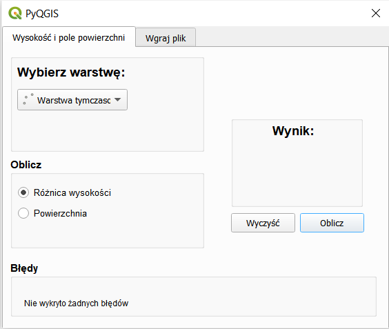
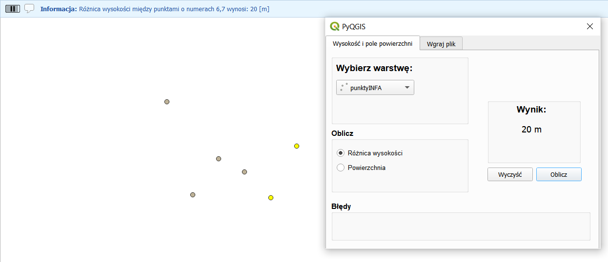
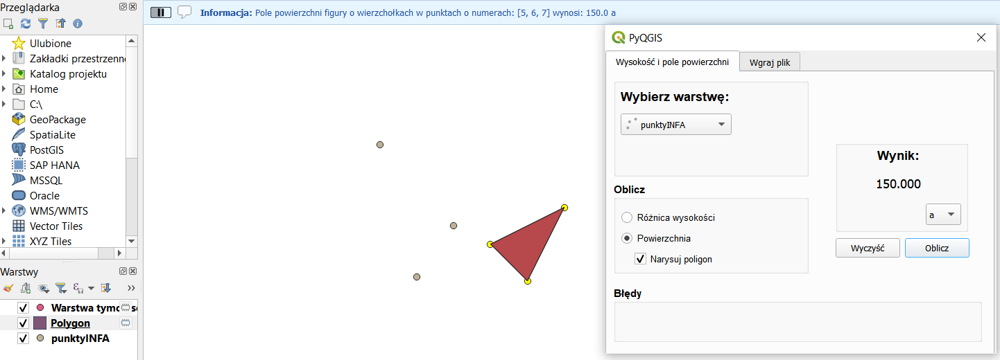
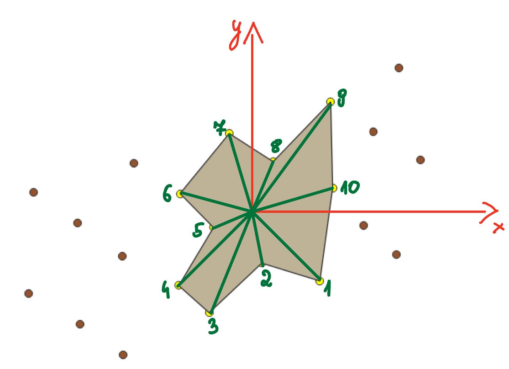
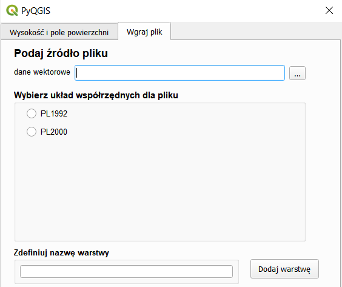
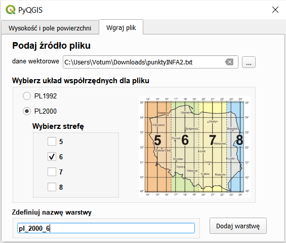

# Opis wtyczki do programu QGIS
Wtyczka do programu QGIS została stworzona w celu obliczania różnicy wysokości oraz pola powierzchni pomiędzy wskazanymi przez użytkownika punktami. Umożliwia także rysowanie poligonu między wskazanymi punktami oraz wgrywanie plików ze współrzędnymi w formacie txt lub csv. Funkcje zostały przydzielone do 2 odrębnych zakładek w oknie wtyczki: 
- związane z obliczeniami (zakładka 1. Wysokość i pole powierzchni)
- związane z wgrywaniem pliku (zakładka 2. Wgraj plik)
## Jak zainstalować wtyczkę

Należy pobrać wszystkie pliki z repozytorium do folderu znajdującego się w folderze "plugins", w którym przechowywane są wtyczki do programu QGIS.

**Przykładowe ścieżki do folderu "plugins":**
- na komputerze z systemem Windows:

C:\Users\\<nazwa_użytkownika>\AppData\Roaming\QGIS\QGIS3\profiles\default\python\plugins

- na komputerze z systemem MacOS:

/Users/<nazwa_użytkownika>/Library/Application\ Support/QGIS/QGIS3/profiles/default/python/plugins

Należy pamiętać, że powyższe ścieżki są przykładowe i mogą różnić się w zależności od konkretnej konfiguracji systemu operacyjnego i zainstalowanej wersji QGIS.


# Opis funkcji w poszczególnych zakładkach
## Zakładka 1. Wysokość i pole powierzchni

## Warunek poprawnego działania wtyczki

 Należy pamiętać, że do poprawnego działania wtyczki (tj. obliczania różnic wysokości, pól powierzchni i rysowania poligonów) wszystkie punkty znajdujące się na używanej do obliczeń warstwie muszą skłądać się z dokładnie 3 współrzędnych (każdy punkt powinien mieć 3 wartości widoczne w kolejnych trzech kolumnach w tabeli atrybutów), z których pierwsze dwie traktowane będą jako współrzędne płaskie X, Y (służące do obliczania pola powierzchni i rysowania poligonu), natomiast trzecia współrzędna będzie traktowana jako wysokość (potrzebna do obliczania różnicy wysokości). Oznacza to, że we wszystkich 3 kolumnach w tabeli atrybutów punktów muszą znajdować się liczby całkowite bądź liczby zmiennoprzecinkowe z częścią dziesiętną zapisaną po kropce. 

Wygląd okna po weściu w zakładkę:



**By obliczyć różnicę wysokości między punktami należy:**
-  wybrać dokładnie dwa punkty z aktywnej warstwy w QGIS, używając w tym celu narzędzia "zaznacz obiekty" z panelu QGIS
-  wybrać w oknie wtyczki, w polu "Wybierz warstwę" warstwę, w której znajdują się zaznaczone wcześniej punkty
-  w polu "Oblicz" wybrać "Różnica wysokości"
-  Wcisnąć przycisk "Oblicz"

**Wynik**

Wynik pojawi się jednocześnie w polu "Wynik", a także na pasku informacyjnym interfejsu QGIS. W przypadku gdy użytkownik wybierze inną liczbę punktów niż dwa, w polu "Błędy" pojawi się informacja o nieprawidłowej liczbie wybranych punktów.

**Sposób obliczania różnicy wysokości**

Program jako wysokości punktów traktuje tą wartość w tabeli atrybutów, która znajduje się w trzeciej kolumnie. Następnie oblicza różnicę wysokości pomiędzy nimi, wyświetlając wynik w wartości bezwzględnej.

Efekt wyznaczania różnicy wysokości:


**By obliczyć pole powierzchni należy:**

-  wybrać co najmniej 3 punkty z aktywnej warstwy w QGIS, używając w tym celu narzędzia "zaznacz obiekty" z panelu QGIS
-  wybrać w oknie wtyczki, w polu "Wybierz warstwę" warstwę, w której znajdują się zaznaczone wcześniej punkty
-  w polu "Oblicz" wybrać "Powierzchnia" (pojawi się opcja "Narysuj poligon", a w polu "Wynik" wybór jednostki wyświetlanego wyniku)
-  w polu "Wynik" wybrać jednostkę, wybierając spośród "m2", "a" lub "ha"
-  w polu "Oblicz" można wybrać opcję "Narysuj poligon".
-  Wcisnąć przycisk "Oblicz"

**Wynik** 

Wynik obliczonego pola powierzchni w wybranej jednostce pojawi się jednocześnie w polu "Wynik", a także na pasku informacyjnym interfejsu QGIS. Dodatkowo, w przypadku wyboru opcji "Narysuj poligon", do projektu dodana zostanie warstwa tymczasowa "Poligon" z figurą o wierzchołkach w zaznaczonych punktach i w układzie współrzędnych zgodnym z tym, zdefiniowanym dla tych punktów. W przypadku, gdy użytkownik wybierze mniej punktów niż trzy, w polu "Błędy" pojawi się informacja o nieprawidłowej liczbie wybranych punktów. 

Efekt wyznaczania pola powierzchni wraz z rysowaniem poligonu:



**Sposób obliczania pola powierzchni i rysowania poligonu**

Punkty (tj. ich współrzędne poziome X i Y) są sortowane względem kąta pomiędzy wektorem od środka figury (obliczanym jako średnia arytmetyczna współrzędnych X i Y wybranych punktów) do punktu i osią x. Program jako współrzędne poziome X i Y traktuje te, które znajdują się w pierwszych dwóch kolumnach w tabeli atrybutów. W efekcie powstanie poniższa figura:



**By wyczyścić konsolę wynikową i zaznaczenie obiektów należy:**

- wybrać w oknie wtyczki, w polu "Wybierz warstwę" warstwę, w której znajdują się zaznaczone punkty
- Wcisnąć przycisk "Wyczyść" 
  
**Wynik** 

Wartość obliczonego pola powierzchni bądź różnicy wysokości w polu "Wynik" zniknie. Odznaczą się również wszystkie punkty i obiekty zaznaczone w bieżącym projekcie.

### Zakładka 2. Wgraj plik

Wygląd okna po wejściu w zakładkę:



**Przykładowy wygląd pliku wgrywanego do programu**

Wartości współrzędnych (X, Y, h) we wstawianym pliku muszą być całkowite lub zmiennoprzecinkowe z częścią dziesiętną po kropce. Współrzędne każdego punktu powinny być umieszczane w kolejnych wierszach pliku, a ich poszczególne składowe (X, Y i h) muszą być oddzielone od siebie średnikami. Pierwsze dwie współrzędne w każdym wierszu są współrzędnymi płaskimi w układzie PL-1992 lub w jednej z 4 stref układu PL-20000, trzecia współrzędna jest wysokością punktu. Należy pamiętać o wpisaniu dokładnie 3 współrzędnych dla każdego punktu (w każdym wierszu trzy wartości oddzielone średnikami). Plik powinien wyglądać jak poniżej:

```bash
5540883.974;7501304.251;100.125
5544653.338;7501989.823;125.152
5548638.675;7501690.090;111.458
5551573.724;7501718.971;145.215
5555466.448;7501509.210;154.133
5558803.270;7501885.332;101.458
5540977.765;7503683.699;105.125
5544932.500;7503979.439;111.254
5547867.289;7503678.933;132.988
5551852.878;7503845.129;124.254
5555467.513;7503693.592;123.899
5558495.534;7504068.584;168.154
5540887.496;7506282.309;147.154
```
**By wgrać plik należy**

-  w polu "Podaj źródło pliku" wskazać ścieżkę do pliku z danymi wektorowymi do wgrania. Plik musi być w formacie .txt lub .csv
-  w polu "Wybierz układ współrzędnych dla pliku" wybrać układ w którym znajdują się współrzędne we wgrywanym pliku. Należy wybrać między układem PL-1992 a PL-2000 (po wyborze układu PL-2000 pojawi się pole "strefy" oraz zdjęcie z zasięgiem poszczególnych stref)
-  W przypadku wyboru układu PL-2000 wybrać strefę, w której znajdują się wstawiane punkty, wybierając spośród: "5", "6", "7" i "8"
-  W polu "Zdefiniuj nazwę warstwy" wpisać nazwę warstwy, do której po wstawieniu będą należeć punkty o współrzędnych zdefiniowanych w pliku
-  Wcisnąć przycisk "Dodaj warstwę"

**Wynik**

Do pamięci podręcznej aplikacji wgrane zostaną współrzędne, a do bieżącego projektu dodana zostanie warstwa tymczasowa o zdefiniowanej przez użytkownika nazwie, w wybranym przez niego układzie odniesienia EPSG (jednym z poniższych):
-  PL-1992 (EPSG:2180) 
-  PL-2000 strefa 5 (EPSG:2176) 
-  PL-2000 strefa 6 (EPSG:2177) 
-  PL-2000 strefa 7 (EPSG:2178) 
-  PL-2000 strefa 8 (EPSG:2179)

Wartości współrzędnych X, Y i h poszczególnych punktów będą widoczne w trzech kolejnych kolumnach tabeli atrybutów dodanej warstwy.

Wygląd okna wtyczki przy wgrywaniu pliku ze współrzędnymi w układzie PL-2000 w strefie 6. Punkty z wgrywanego pliku będą należeć do warstwy o nazwie "pl_2000_6" i wstawią się w układzie EPSG: 2177:


