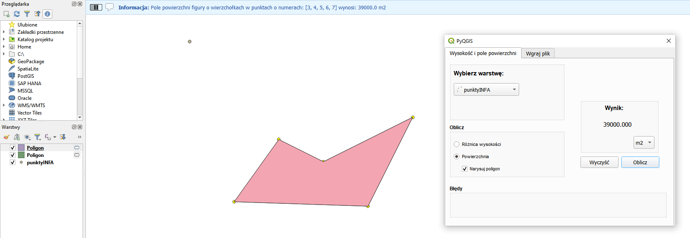

# Wtyczka QGIS
## Opis
Wtyczka do programu QGIS została stworzona w celu obliczania różnicy wysokości oraz pola powierzchni pomiędzy wskazanymi przez użytkownika punktami. Umożliwia także wgrywanie plików ze współrzędnymi w formacie txt lub csv. Funkcje wtyczki zostały podzielone na 2 odrębne zakładki: 
- związane z obliczeniami
- związane z wgrywaniem pliku

## Funkcjonalność wtyczki
**Zakładka 1. Wysokość i pole powierzchni**

**Zakładka 2. Wgraj plik**

## Opis funkcji w poszczególnych zakładkach
### Zakładka 1. Wysokość i pole powierzchni

Wygląd okna po weściu w zakładkę:

**By obliczyć różnicę wysokości między punktami należy:**
-  wybrać dwa punkty z aktywnej warstwy w QGIS, używając w tym celu narzędzia "zaznacz obiekty" w panelu QGIS
-  włączyć wtyczkę PyQGIS
-  wybrać w oknie wtyczki warstwę, na której znajdują się zaznaczone wcześniej punkty
-  w polu "Oblicz" wybrać "Różnica wysokości"
-  Wcisnąć przycisk "Oblicz"

**Wynik**

Wynik pojawi się jednocześnie w polu "Wynik", a także na pasku informacyjnym interfejsu QGIS. W przypadku gdy użytkownik wybierze inną liczbę punktów niż dwa, w polu "Błędy" pojawi się informacja o nieprawidłowej liczbie wybranych punktów.

Efekt wyznaczania różnicy wysokości:

**By obliczyć pole powierzchni należy:**

-  wybrać co najmniej 3 punkty z aktywnej warstwy w QGIS, używając w tym celu narzędzia "zaznacz obiekty" w panelu QGIS
-  włączyć wtyczkę PyQGIS
-  wybrać w oknie wtyczki warstwę, na której znajdują się zaznaczone wcześniej punkty
-  w polu "Oblicz" wybrać "Powierzchnia" (pojawi się opcja "Narysuj poligon", a w polu "Wynik" wybór jednostki wyświetlanego wyniku)
-  w polu "Wynik" wybrać jednostkę, wybierając spośród "m2", "a" lub "ha"
-  w polu "Oblicz" można wybrać opcję "Narysuj poligon"
-  Wcisnąć przycisk "Oblicz"

**Wynik** 

Wynik obliczonego pola powierzchni w wybranej jednostce pojawi się jednocześnie w polu "Wynik", a także na pasku informacyjnym interfejsu QGIS. Dodatkowo, w przypadku wyboru opcji "Narysuj poligon", do projektu dodana zostanie warstwa tymczasowa "Poligon". W przypadku, gdy użytkownik wybierze mniej punktów niż trzy, w polu "Błędy" pojawi się informacja o nieprawidłowej liczbie wybranych punktów. 

Efekt wyznaczania pola powierzchni wraz z rysowaniem poligonu:

### Zakładka 2. Wgraj plik

Wygląd okna po wejściu w zakładkę:

**By wgrać plik należy**

-  w polu "Podaj źródło pliku" należy wskazać ścieżkę do pliku z danymi wektorowymi do wgrania. Plik musi być w formacie .txt lub .csv
-  w polu "Wybierz układ współrzędnych dla pliku" należy wybrać układ w którym znajdują się współrzędne we wgrywanym pliku. Należy wybrać między układem PL-1992 a PL-2000 (po wyborze układu PL-2000 pojawi się pole "strefy" oraz zdjęcie z zasięgiem poszczególnych stref)
-  W przypadku

– wybór dwóch punktów z aktywnej warstwy oraz obliczenie różnicy wysokości\
–podanie na pasku informacyjnym interfejsu QGIS tekstu wynikowego\
–wybór minimum trzech punktów z warstwy\
–obliczenie pole powierzchni na podstawie współrzędnych zaznaczonychpunktów metodą Gaussa\
–monit w przypadku zaznaczenia zbyt małej liczby punktów do wykonaniaobliczeń
–Wskazanie w jakim układzie współrzędnych będzie plik do wgrania: 1992czy 2000 (+ strefa)\
Wybranie i otwarcie pliku tekstowego .txt lub .csv,\
∗Wgranie zawartości pliku do pamięci podręcznej aplikacji - umiejscowieniew tabeli (QTableWidget),∗Dodanie warstwy w odpowiednim układzie odniesienia (EPSG) do bieżą-cego projektu QGIS,–na podstawie zaznaczonych punktów do obliczenia pola powierzchni, narysujpoligon, dodaj go do nowej warstwy projektu i sprawdź atrybutgeometry().area()dla porównania,1
–czyszczenie konsoli wynikowej i zaznaczenia obiektów na żądanie użytkownika,–wybór opcji czy pole powierzchni ma być wyświetlane w m2czy w arach czyw ha i wyświetlenie wyniku obliczenia zgodnie z wyborem użytkownika.

